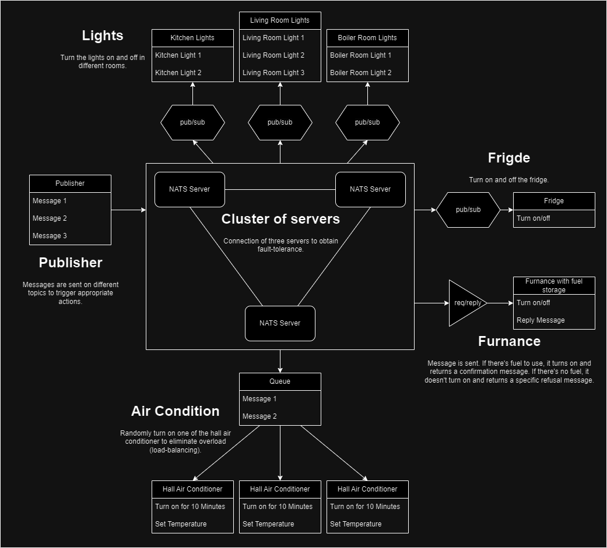

# Service Sharing Environments - NATS

This repository hosts the source files and documentation for the final project of the Service Sharing Environments course (2023/2024) at AGH UST. The project focuses on utilizing NATS technology.

## Authors

Authors:

- Mateusz Skowron
- Adrian Chrobot
- Wojciech Łącki
- Mateusz Mazur

Year, Group: **2024**, **pt 15:30**

## 1. Introduction

The primary objective of this project is to explore and familiarize ourselves with the [NATS](https://nats.io/) messaging system and to conduct a simple case study that demonstrates its key advantages and functionalities. By delving into NATS, we aim to gain insights into its architecture, scalability, reliability, and performance characteristics. Through our case study, we intend to showcase how NATS can facilitate efficient communication between microservices or distributed components within a system, highlighting its suitability for modern, cloud-native environments.

## 2. Theoretical background/technology stack

### NATS Overview

NATS (Not Another Typical System) is a lightweight, high-performance messaging system designed for distributed systems and cloud-native applications. It operates on a publish-subscribe model, offering scalability, simplicity, resilience, performance, security, and cloud-native integration.

#### Key Features

- **Scalability**: Handles millions of messages per second with low latency.
- **Simplicity**: Easy to deploy, use, and integrate, reducing operational overhead.
- **Resilience**: Ensures message delivery even during network partitions or failures.
- **Performance**: Delivers low-latency message transmission and processing.
- **Security**: Supports authentication and authorization mechanisms.
- **Cloud-Native Integration**: Well-suited for dynamic environments like Kubernetes.

#### Limitations

- **Complex Routing**: Not suitable for complex message routing patterns.
- **Limited Message Durability**: Defaults to in-memory operation; durable messaging requires add-ons like JetStream.

#### JetStream

NATS JetStream enhances the capabilities of NATS by providing durable and persistent messaging features, ensuring message durability, retention, and replayability.

##### Key Features

- **Message Persistence**: Messages are stored on disk for long-term durability, ensuring they are not lost in case of system failures.
- **Replication and High Availability**: Supports message replication across multiple NATS servers, ensuring high availability and fault tolerance.
- **Stream Processing**: Enables advanced stream processing capabilities, including the ability to replay messages on demand, temporal decoupling between publishers and subscribers, and support for multiple use cases.
- **Consumer Groups**: Facilitates load balancing among consumers through consumer groups, allowing for efficient and scalable message consumption.
- **Quality of Service (QoS)**: Offers a range of delivery guarantees, including at-most-once delivery by default, and support for at-least-once and exactly-once delivery in JetStream, ensuring message delivery according to application requirements.

##### Limitations

- **Complexity**: Introduces additional complexity in configuration and management compared to basic NATS functionality.
- **Performance Overhead**: May incur a performance overhead, particularly in high-volume deployments, due to the persistence and replication mechanisms.
- **Operational Challenges**: Requires specialized tools and expertise for setup and ongoing maintenance, posing operational challenges for organizations managing JetStream-enabled NATS clusters.

#### Protocol

NATS leverages a streamlined and highly efficient protocol for message transmission, ensuring exceptional performance and minimal latency. Its protocol is designed with simplicity in mind, boasting a lightweight messaging format optimized for reduced overhead and efficient message routing. By employing a compact binary format for message encoding, NATS significantly reduces transmission costs. Moreover, NATS supports popular data serialization protocols such as JSON or Protocol Buffers, fostering seamless interoperability and effortless integration across diverse programming languages and platforms.

Operational over TCP/IP, NATS guarantees reliable, connection-oriented communication between clients and servers. It incorporates essential features like message acknowledgment, heartbeats, and robust connection management to uphold resilience and fault tolerance in distributed environments. Additionally, NATS prioritizes data security through TLS encryption, safeguarding confidentiality and integrity during communication.

#### Use cases

NATS finds versatile application across various scenarios:

- **Microservices Communication**: NATS seamlessly facilitates communication within microservices architectures, enabling smooth interaction and coordination. Its asynchronous communication model empowers decoupling and scalability among services.

- **Event-Driven Architecture**: Serving as a robust backbone for event-driven architectures, NATS enables real-time publication and consumption of events across system components, fostering agile responsiveness and asynchronous communication.

- **IoT Messaging and Edge Computing**: NATS stands out in IoT applications, providing lightweight and scalable messaging solutions for device-to-device and device-to-cloud communication. Its efficiency makes it ideal for resource-constrained networks typical in IoT and edge computing environments.

#### Comparison to similar technologies

When comparing NATS with other messaging technologies such as Apache Kafka, RabbitMQ, gRPC, and Apache Pulsar, several key distinctions emerge, offering insights into their respective strengths and applicability.

##### Language and Platform Coverage

NATS stands out with its extensive client language support, offering 48 known client types and various contributed by the community. Its servers can be compiled on architectures supported by Golang, providing flexibility. In contrast, Kafka supports 18 client types but primarily relies on Java, while RabbitMQ offers support for multiple platforms including Linux and Windows.

##### Built-in Patterns

NATS excels in supporting streams and services through built-in publish/subscribe, request-reply, and load-balanced queue subscriber patterns, along with dynamic request permissioning. Kafka and Pulsar offer similar functionalities for streams through publish/subscribe but may require more intricate application code for request-reply patterns. gRPC focuses on one service per channel with support for streaming semantics, while RabbitMQ offers streams through publish/subscribe and direct reply-to features.

##### Delivery Guarantees

While Kafka provides robust at-least-once and exactly-once delivery guarantees, NATS and RabbitMQ offer similar guarantees but may lack exactly-once support in certain configurations. gRPC, on the other hand, focuses primarily on at-most-once delivery.

##### Multi-tenancy and Sharing

NATS stands out with its support for true multi-tenancy and decentralized security through accounts, while other technologies like Kafka and RabbitMQ offer multi-tenancy support but with different implementations.

##### Authentication and Authorization

NATS provides various authentication options including TLS, NATS credentials, NKEYS, username/password, or simple token. Kafka supports Kerberos and TLS authentication, while RabbitMQ offers TLS, SASL, username/password authentication, among others.

##### Message Retention and Persistence

NATS supports memory, file, and database persistence with replayability options, while Kafka and Pulsar offer file-based persistence with additional features such as log compaction and tiered storage. RabbitMQ supports file-based persistence but lacks message replayability.

##### High Availability and Fault Tolerance

NATS offers full mesh clustering and warm failover backup servers for high availability, while Kafka relies on fully replicated cluster members coordinated via Zookeeper. Pulsar supports clustered brokers with geo-replication, whereas RabbitMQ supports clustering with full data replication.

##### Deployment

NATS' lightweight and flexible deployment options, including support for resource-constrained devices and cloud environments, contrast with Kafka's more resource-intensive requirements. Pulsar also offers clustering but with specific hardware and software prerequisites.

##### Monitoring and Management

NATS provides robust monitoring capabilities through Prometheus and Grafana, while Kafka offers various management tools like Confluent Control Center. Pulsar and RabbitMQ also offer monitoring and management tools but may require additional configurations.

##### Integrations

NATS boasts a wide array of integrations including WebSockets, Kafka bridge, Redis Connector, and more, enhancing its interoperability. Kafka and Pulsar also offer extensive integrations within their ecosystems, while RabbitMQ provides plugins for various protocols and authentication mechanisms.

#### Summary

NATS emerges as a versatile messaging solution, blending simplicity, performance, and scalability, making it a cornerstone for modern distributed systems and microservices architectures. With extensions like JetStream, NATS further extends its capabilities to encompass durable messaging and event streaming, bolstering its suitability across a broad spectrum of use cases.

## 3. Case study concept description

#### Objectives

The main objectives of this case study are:

- Test various build-in patterns: publish/subscribe, request-reply and load-balanced queue subscriber.
- Test connection between the NATS servers.
- Test fault-tolerance by turning off one of the NATS servers.
- Perform real-life use cases with an emphasis on stressing the system due to the influx of messages.

#### Methodology

Presented objectives of this study will be achieved by following steps:

- **Real-life use cases creation**: We will create architecture of the system to present all needed features of studie technology.
- **Environment creation**: Appropriate environment will be created according to the schema.
- **Conduct the tests**: When the system will be finished, we want to execute various tests and collect the needed data to further analysis.
- **Analyze the results**: Collected data will be analysed and conclusions will be gathered.
- **Presentation of the results**: We will show obtained conclusions and convey our opinion about NATS technology.

## 4. Solution Architecture



The solution contains three NATS servers connected in one cluster. Architecture includes several objects that could be found in any house, eg. lights, fridge, air conditioners or furnance. Those objects will help us expose some features of NATS technology. Description of those objects could be found in above diagram. All build-in patterns are included in schema: publish/subscribe, request-reply and load-balanced queue subscriber.

## 5. Environment configuration description

## 6. Installation method

### Docker

Deploy a 3-node cluster with JetStream support using Docker containers. Each container mounts the NATS cluster configuration from docker/cluster/nats.conf. Please note, switching between containers in case of failure is not supported due to the absence of a load balancer.

```sh
docker compose -f deployment/docker/docker-compose.yaml up -d --build
```

### AWS

```sh
aws eks update-kubeconfig --region <region> --name <clustername>
```

### Local Kubernetes cluster

1. Install and Start Minikube

    Ensure you have Minikube installed and running on your local machine. If not, you can install it from [here](https://minikube.sigs.k8s.io/docs/start/).

2. Deploy NATS

    Navigate to the deployment/helm directory and initialize Terraform:

    ```sh
    cd deployment/helm
    terraform init
    ```

    Deploy NATS using Terraform:

    ```sh
    terraform apply
    ```

3. Assign External IP to NATS Service

    Run the tunnel in a separate terminal:

    ```sh
    minikube tunnel
    ```

    This command will provide you with the external IP address to access NATS.


## 7. How to reproduce - step by step

## 8. Demo deployment steps

## 9. Summary

## 10. References

- https://nats.io/
